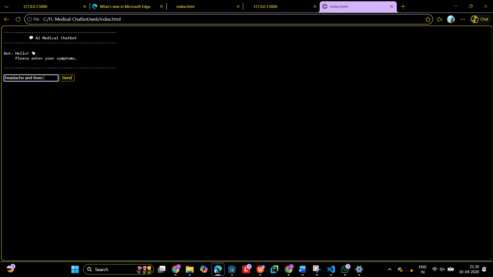
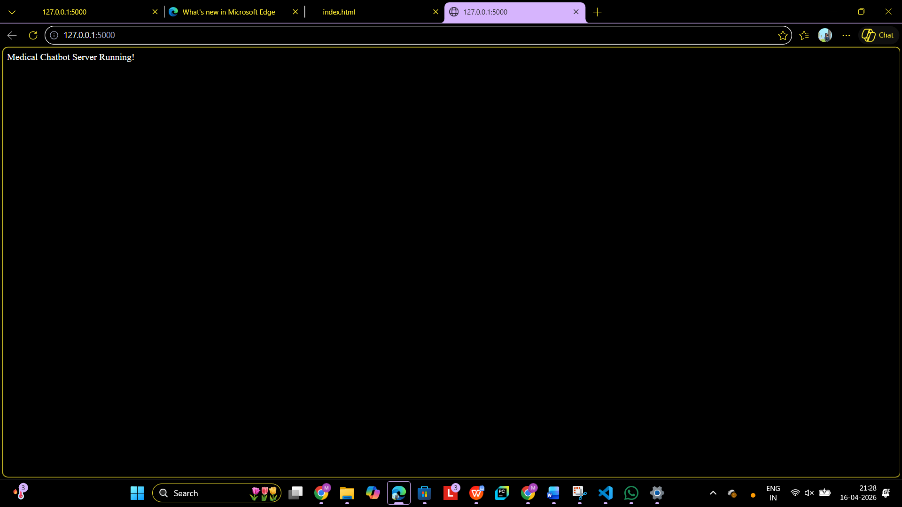
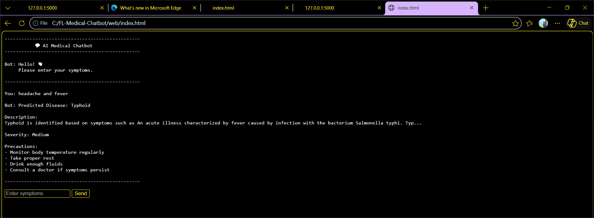
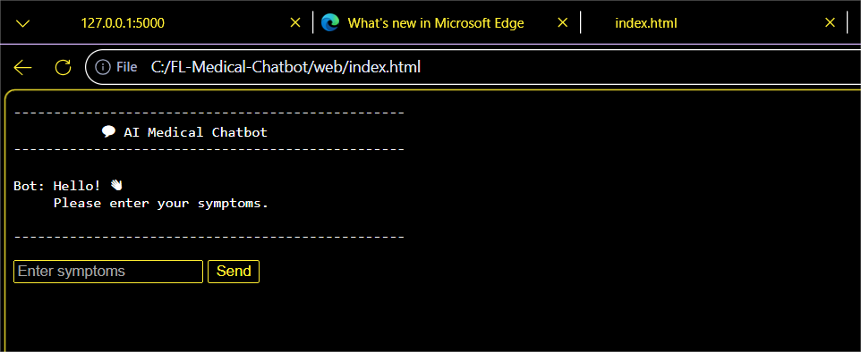

# Medical Chatbot

An AI-powered medical chatbot that helps users identify possible health conditions based on symptoms and provides disease descriptions, severity levels, and precautionary measures. The platform combines Natural Language Processing (NLP), Machine Learning, and Federated Learning to deliver intelligent healthcare assistance through a web-based interface.

## Features

* Symptom-based disease prediction.
* Interactive chatbot interface.
* Disease description and precaution recommendations.
* Severity assessment for reported symptoms.
* REST API backend using Flask.
* Federated Learning support using Flower framework.
* BERT-based NLP processing.
* CSV-based medical dataset integration.
* Real-time response generation.
* Cross-Origin Resource Sharing (CORS) support.

## Tech Stack

### Frontend

* HTML5
* CSS3
* JavaScript

### Backend

* Python
* Flask
* Flask-CORS

### Machine Learning & NLP

* BERT (bert-base-uncased)
* Transformers
* PyTorch

### Federated Learning

* Flower (FLWR)

### Data Processing

* Pandas
* NumPy

## Repository Structure

```text
medical-chatbot/
│
├── chatbot/      Chatbot logic and NLP processing
├── client/       Federated learning client
├── server/       Flask API and federated learning server
├── web/          Frontend files
├── data/         Medical datasets
├── requirements.txt
└── README.md
```

## Architecture

The system consists of:

* Frontend web interface for user interaction.
* Flask REST API backend.
* NLP engine powered by BERT.
* Medical dataset processing module.
* Federated Learning server and client using Flower.

## Prerequisites

* Python 3.10+
* pip
* Virtual Environment (recommended)

## Installation

Clone the repository:

```bash
git clone https://github.com/manapuram-shirisha/medical-chatbot.git
cd medical-chatbot
```

Create a virtual environment:

```bash
python -m venv venv
```

Activate environment:

```bash
venv\Scripts\activate
```

Install dependencies:

```bash
pip install -r requirements.txt
```

## Running the Project

Start the Flask server:

```bash
python server/server.py
```

Open the frontend:

```bash
Open web/index.html
```

## How It Works

1. User enters symptoms through the chatbot interface.
2. Symptoms are sent to the Flask API.
3. NLP model processes the input.
4. Disease information is retrieved.
5. The chatbot returns:

   * Disease Name
   * Description
   * Severity Level
   * Precautions

## Future Improvements

* Doctor recommendation system.
* Appointment booking integration.
* Voice-enabled chatbot.
* Multilingual support.
* Cloud deployment.
* Advanced disease prediction models.

## Screenshots

### Medical Chatbot Server Running



### AI Medical Chatbot Home Page



### Symptom Input Example



### Disease Prediction Result


## Author

Shirisha Manapuram

B.Tech – Computer Science Engineering

GitHub: https://github.com/manapuram-shirisha
